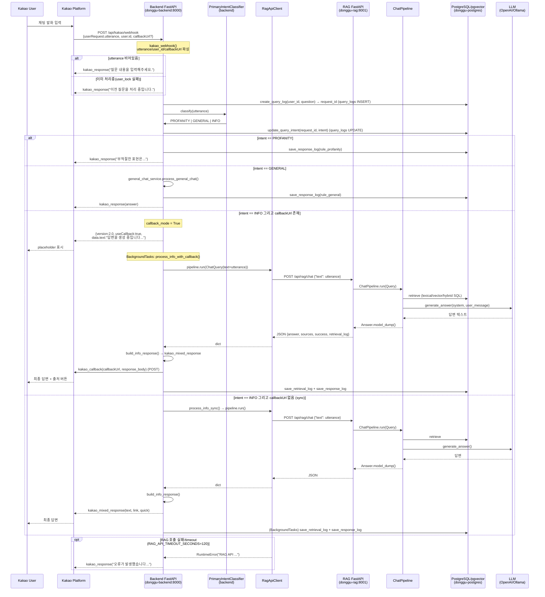
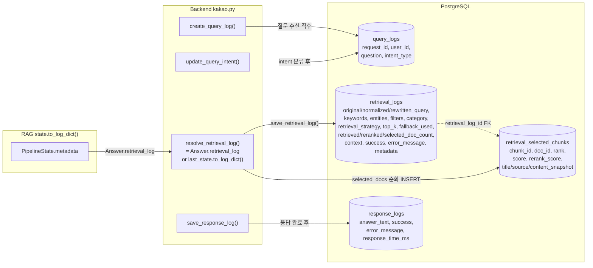

# RAG Pipeline End-to-End Diagram

> 본 문서는 **현재 코드베이스(dev 브랜치)** 를 직접 추적해 작성했습니다.
> Kakao 사용자의 발화 입력 → Backend → RAG → Backend → Kakao 응답까지의 왕복 흐름을 파일/함수/클래스명 기준으로 분해합니다.
> Docker 서비스명: `donggu-backend`(8000), `donggu-rag`(8001), `donggu-postgres`(pgvector pg15).

---

## 1. 분석 대상 코드 파일

| 영역 | 파일 | 역할 |
|---|---|---|
| Kakao Webhook | `backend/app/api/kakao.py` | `kakao_webhook()` — webhook 진입점, intent 분기, sync/callback 라우팅, 응답 빌드 |
| 라우터 등록 | `backend/app/api/router.py` | `/api/kakao` prefix로 kakao 라우터 등록 (최종 경로 `/api/kakao/webhook`) |
| Intent 분류(Backend) | `backend/app/utils/intent_classifier.py` | `PrimaryIntentClassifier.classify()` — PROFANITY/GENERAL/INFO 판정 |
| 욕설 필터 | `backend/app/utils/profanity_filter.py` | `contains_profanity()` |
| 동시요청 잠금 | `backend/app/utils/user_lock.py` | `acquire_user_lock()` / `release_user_lock()` |
| RAG HTTP 클라이언트 | `backend/app/services/rag_client.py` | `RagApiClient.run()` — `POST http://rag:8001/api/rag/chat` 호출 |
| Kakao 콜백 | `backend/app/utils/callback.py` | `kakao_callback()` — 비동기 callbackUrl로 POST |
| Kakao 응답 템플릿 | `backend/app/utils/kakao_template.py` | `kakao_response()` / `kakao_mixed_response()` |
| Kakao UI | `backend/app/utils/kakao_ui.py` | quick replies / 카테고리 / 링크 / 타이틀 매핑 |
| 로그 저장 | `backend/app/database/{query_logs,retrieval_logs,response_logs}.py` | 3종 로그 테이블 + `retrieval_selected_chunks` 저장 |
| DB 풀 | `backend/app/database/db.py` | `SimpleConnectionPool` (psycopg2) |
| RAG API | `rag/app/main.py` | FastAPI `POST /api/rag/chat` → `ChatPipeline.run()` |
| 파이프라인 오케스트레이터 | `rag/pipeline/chat_pipeline.py` | `ChatPipeline.run()` (~1591줄) — 전 단계 조율, fallback, 도메인 교정 |
| 파이프라인 상태 | `rag/pipeline/state.py` | `PipelineState` — 단계 간 단일 진실원, `to_log_dict()` |
| 전처리 | `rag/pipeline/preprocessor.py` | `QueryPreprocessor.run()` — 정규화/키워드/엔티티/필터/rewrite |
| Intent(RAG) | `rag/preprocess/primary_intent.py` | `PrimaryIntentClassifier.classify()` |
| 임베딩 | `rag/embedding/koe5_embedder.py` | `KoE5Embedder.embed_query()` |
| 검색요청 빌드 | `rag/retrieval/search_strategy.py` | `build_retrieval_request()` → `RetrievalRequest` |
| Multi-Query | `rag/retrieval/multi_query.py` | `generate_query_variants()` + `reciprocal_rank_fusion()` |
| 검색기 | `rag/retrieval/retriever.py` | `retrieve_documents()` — lexical/vector/hybrid + 보충검색 |
| 검색 스키마 | `rag/schemas/retrieval.py` | `RetrievalRequest` / `RetrievalResponse` |
| 품질 게이트 | `rag/retrieval/quality.py` | `retrieval_quality_result()` |
| 시간성 검증 | `rag/retrieval/temporal.py` | `validate_temporal_evidence()` |
| 리랭커 | `rag/selection/reranker.py` | `rerank_documents()` — 다신호 규칙 점수 |
| Cross-Encoder | `rag/selection/cross_encoder.py` | (플래그 on) 상위후보 의미유사도 블렌딩 |
| Top-K 선택 | `rag/selection/topk_selector.py` | `select_topk_with_diagnostics()` — dedupe/다양성/오염제거 |
| 컨텍스트 구성 | `rag/selection/context_builder.py` | `build_context()`(로깅용) / `build_llm_context()`(슬림) |
| 프롬프트 | `rag/prompt/prompt_builder.py` | `build_system_prompt()` / `build_user_message()` |
| LLM 생성 | `rag/llm/answer_generator.py` | `generate_answer()` — OpenAI / Ollama |
| 후처리 | `rag/generation/answer_postprocessor.py` | `repair_negative_answer_with_context()` / `strip_markdown_formatting()` |
| Fallback | `rag/fallback/{fallback_handler,policy,extractive}.py` | 에러/무결과 시 답변 생성 |
| 최종 스키마 | `rag/schemas/answer.py` | `Answer(question, answer, sources, success, retrieval_log)` |

---

## 2. Kakao → Backend → RAG → Backend → Kakao 전체 Sequence Diagram



> **확인 필요:** sync 경로는 카카오 5초 타임아웃을 초과할 수 있어 실제 운영에서는 `callbackUrl` 기반 비동기 경로가 정상 동작 경로로 보입니다(코드상 두 경로 모두 존재).

---

## 3. RAG 내부 Pipeline Flowchart

`ChatPipeline.run()` (`rag/pipeline/chat_pipeline.py:77`) 기준. 각 단계는 `_timed_stage()`로 감싸 `state.metadata["timings_ms"]`에 계측됩니다.

```mermaid
flowchart TD
    A["rag/app/main.py<br/>chat() POST /api/rag/chat"] --> B["chat_pipeline.py<br/>ChatPipeline.run(query)"]
    B --> C["PipelineState.from_query()<br/>state 생성 · self.last_state 저장"]
    C --> D["_classify_primary_intent()<br/>PrimaryIntentClassifier.classify()"]

    D --> E{primary_intent == INFO?}
    E -- "아니오(GENERAL/PROFANITY)" --> E1["_build_direct_answer()<br/>LLM 우회 · 고정 안내문"]
    E1 --> Z["Answer 반환"]

    E -- "예" --> F["preprocessor.run()<br/>QueryPreprocessor"]
    subgraph PRE["전처리 (preprocessor.py)"]
        F --> F1["normalize_query()<br/>정규화"]
        F1 --> F2["apply_synonym_filter()<br/>동의어 확장(lexical_query)"]
        F2 --> F3["extract_hybrid_keywords()<br/>Aho/Kiwi/lexical 키워드"]
        F3 --> F4["extract_entities() / build_filters()<br/>엔티티·필터"]
        F4 --> F5["extract_query_features()<br/>domain/category/family/strong_terms"]
        F5 --> F6["rewrite_query() / rewrite_queries_from_bundle()<br/>변형 질의 + protected term 보존"]
    end

    F6 --> G["_embed_query()<br/>KoE5Embedder.embed_query()<br/>state.query_vector"]
    G --> H["_retrieve()"]

    subgraph RET["검색 (retrieve)"]
        H --> H1["build_retrieval_request()<br/>RetrievalRequest 구성"]
        H1 --> H2["_effective_retrieval_strategy()<br/>family→vector / 기본 hybrid"]
        H2 --> H3{RAG_LOG_BRANCH_CANDIDATES?}
        H3 -- "1" --> H4["_collect_branch_candidates()<br/>lexical+vector 진단(오버헤드)"]
        H3 -- "0(기본)" --> H5
        H4 --> H5["_multi_query_retrieve()"]
        H5 --> H6["generate_query_variants()<br/>LLM 재표현 N개"]
        H6 --> H7["ThreadPoolExecutor fan-out<br/>retrieve_documents() 병렬"]
        H7 --> H8["reciprocal_rank_fusion()<br/>RRF 융합"]
        H8 --> H9["_evaluate_retrieval_quality()<br/>top1/avg/context/noise/entity"]
        H9 --> H10{quality.ok?}
        H10 -- "아니오" --> H11["_fallback_retrieve()<br/>RAG_FALLBACK_ORDER 순회"]
        H10 -- "예" --> I
        H11 --> H12{결과 있음?}
        H12 -- "아니오" --> H13["raise NoRetrievalResultsError"]
        H12 -- "예" --> I
    end

    H13 -.예외.-> Y
    I["_select_and_build_context()"] --> J["rerank_documents()<br/>다신호 규칙점수 + (CE 블렌딩)"]
    subgraph SEL["선택 (topk_selector / corrections)"]
        J --> J1["forbidden_source 필터<br/>+ family별 필터(이수표/공지)"]
        J1 --> J2["select_topk_with_diagnostics()<br/>dedupe·다양성·오염제거 (k=3)"]
        J2 --> J3["_correct_faculty_selection()<br/>_correct_department_faculty_list_selection()<br/>_correct_facility_selection()"]
        J3 --> J4["_evaluate_selection_quality()<br/>+ validate_temporal_evidence()"]
        J4 --> J5["build_context()<br/>로깅용 풀 컨텍스트(state.context)"]
    end

    J5 --> K2["_generate()"]
    subgraph GEN["생성 (generate_answer)"]
        K2 --> K3["build_llm_context()<br/>슬림 컨텍스트(ID/점수 제외)"]
        K3 --> K4{temporal mismatch?}
        K4 -- "예" --> K5["temporal_mismatch 힌트 주입"]
        K4 -- "아니오" --> K6
        K5 --> K6["build_system_prompt() / build_user_message()"]
        K6 --> K7["generate_answer()<br/>OpenAI/Ollama"]
        K7 --> K8["repair_negative_answer_with_context()<br/>거절 답변 근거기반 복구"]
    end

    K8 --> L2["_postprocess()<br/>strip_markdown_formatting()"]
    L2 --> M["_build_success_answer()<br/>Answer(success=True, retrieval_log=to_log_dict())"]
    M --> Z

    Y["_build_fallback_answer()<br/>handle_fallback()"] --> Z
    Z["rag/app/main.py: Answer.model_dump() 반환"]

    B -. "예외 발생 시 except" .-> Y
```



---

## 4. Retrieval 상세 Flowchart

`retrieve_documents()` (`rag/retrieval/retriever.py:225`) — DB 우선, 실패 시 파일 BM25 폴백.

```mermaid
flowchart TD
    A["retrieve_documents(request: RetrievalRequest)"] --> B{empty_query<br/>fallback_trigger?}
    B -- "예" --> Z0["return []"]
    B -- "아니오" --> C{_use_database_retriever()?<br/>RAG_USE_DB / DATABASE_URL}

    C -- "아니오/psycopg2 없음" --> FILE
    C -- "예" --> D["_resolve_retrieval_mode(request)<br/>RETRIEVAL_MODE 또는 strategy"]

    D --> E{mode}
    E -- "vector" --> V1["_retrieve_documents_from_database_vector()<br/>chunk_embeddings: embedding <=> query_vector<br/>(pgvector cosine, LIMIT candidate)"]
    E -- "hybrid" --> H1["_retrieve_documents_from_database_hybrid()"]
    E -- "lexical(기본 진입은 hybrid)" --> LEX1["_retrieve_documents_from_database()"]

    subgraph HYB["hybrid 병합"]
        H1 --> H2["_retrieve_documents_from_database()<br/>(lexical 분기)"]
        H1 --> H3["_retrieve_documents_from_database_vector()<br/>(vector 분기)"]
        H2 --> H4["merge_retrieval_candidates()<br/>chunk_id 기준 dedupe + RRF score"]
        H3 --> H4
        H4 --> H5["_apply_hybrid_final_scores()<br/>HYBRID_SCORE_MODE:<br/>weighted(0.55/0.45)/max/rrf/srrf"]
        H5 --> H6["_candidates_to_retrieved_docs()"]
    end

    subgraph LEXSQL["lexical SQL (_retrieve_documents_from_database)"]
        LEX1 --> LEX2["_build_db_search_terms()<br/>family 확장 + feature terms + 키워드"]
        LEX2 --> LEX3["candidate_chunks:<br/>to_tsvector('simple') @@ to_tsquery<br/>(content/section_title/title) UNION<br/>ILIKE ANY(...) substring"]
        LEX3 --> LEX4["score: ts_rank + term/title/section ILIKE 가산<br/>+ category_bonus − noise_penalty"]
        LEX4 --> LEX5["latest_document_versions 필터<br/>(최신 버전 + attachment 예외)"]
    end

    V1 --> SUP["보충 검색 prepend(_prepend_unique_docs)"]
    H6 --> SUP
    LEX5 --> SUP

    subgraph SUPP["조건부 보충 검색 (family/질의 기반)"]
        SUP --> SUP1["_retrieve_canonical_documents_from_database_v4()<br/>학사일정/수강신청 canonical 공지"]
        SUP1 --> SUP2["_retrieve_graduation_policy_documents...<br/>졸업요건"]
        SUP2 --> SUP3["_retrieve_curriculum_regulation_documents()<br/>이수규정"]
        SUP3 --> SUP4["_retrieve_department_curriculum_documents()<br/>학과 이수표 직접검색"]
        SUP4 --> SUP5["_retrieve_location_documents() / _retrieve_faculty_documents()<br/>위치·교수"]
    end

    SUP5 --> POST["_postprocess_retrieved_docs()"]
    subgraph PP["후처리"]
        POST --> PP1["_filter_forbidden_source_types()<br/>family별 금지 source_type 제거"]
        PP1 --> PP2["_apply_section_priority_for_curriculum()<br/>sub03(교육과정) boost"]
        PP2 --> PP3["_dedupe_retrieved_docs()<br/>content_hash·doc·source·canonical_group 제한"]
        PP3 --> PP4["docs[:top_k] 반환"]
    end

    FILE["파일 BM25 폴백"] --> FILE1["_load_bm25_index()<br/>chunks JSON 인덱스(lru_cache)"]
    FILE1 --> FILE2["_build_query_tokens()<br/>KoreanBM25Tokenizer(Kiwi/regex)"]
    FILE2 --> FILE3["_score_documents()<br/>BM25 k1=1.5 b=0.75"]
    FILE3 --> POST

    PP4 --> OUT["list[RetrievedDoc] → 파이프라인"]
```

**TopKSelector 선택 기준** (`select_topk_with_diagnostics`, k=3):
1. `chunk_id` / `doc_id` 중복 제거 (`max_chunks_per_doc`는 family별 1~4).
2. `_has_exact_or_strong_match()` 문서를 **exact 그룹**으로 최우선.
3. `_is_context_contamination_candidate()`(노이즈·heading 불일치) 후보는 **rejected** 처리.
4. `_is_static_or_menu_candidate()`(index/menu/UI 노이즈)는 후순위.
5. `_would_overfill_source_type()`로 동일 source_type 편중 방지(다양성).
6. 부족 시 `min_fallback`까지 보충, 최종 `selected[:k]` 반환.

---

## 5. Logging / Observability Flow

로그는 Backend의 `BackgroundTasks`(또는 동기)로 PostgreSQL에 저장됩니다. RAG는 `state.to_log_dict()`로 진단 dict를 만들어 `Answer.retrieval_log`에 실어 반환하고, Backend가 이를 `retrieval_logs` + `retrieval_selected_chunks`에 저장합니다.



**필드 추적 표** (요청 `original_query` 기준):

| 필드 | 생성 위치(코드) | 저장 테이블/컬럼 |
|---|---|---|
| `original_query` | `kakao_webhook` utterance → `PipelineState.original_query` | `query_logs.question`, `retrieval_logs.original_query` |
| `normalized_query` | `preprocessor.run` → `normalize_query()` | `retrieval_logs.normalized_query` |
| `rewritten_query` / `rewritten_queries` | `rewrite_query()` / `rewrite_queries_from_bundle()` | `retrieval_logs.rewritten_query`, `rewritten_queries` |
| `intent` | `PrimaryIntentClassifier.classify()` | `query_logs.intent_type` |
| `category` | `extract_query_features().category` / `primary_category()` | `retrieval_logs.category` |
| `department` | `entity_extractor` → `filters.department`, `ranking_hints.department_entity` | `retrieval_logs.filters`, `metadata` |
| `filters` | `build_filters()` + `sanitize_filters()` | `retrieval_logs.filters` |
| `lexical_candidates` / `vector_candidates` | `_retrieve_documents_from_database_hybrid` (`hybrid_*_candidate_count`) | `retrieval_logs.metadata`, branch trace |
| `hybrid_score` | `_apply_hybrid_final_scores()` (`final_score`/`rrf_score`) | `retrieval_selected_chunks.score`, `metadata` |
| `rerank_score` | `rerank_documents()` | `retrieval_selected_chunks.rerank_score` |
| `selected_chunks` | `select_topk_with_diagnostics()` → `state.selected_docs` | `retrieval_selected_chunks` (rank별 행) |
| `final_context` | `build_context()` (`state.context`) | `retrieval_logs.context` |
| `answer` | `generate_answer()` → `state.answer_text` | `response_logs.answer_text` |
| `fallback_used` | `_retrieve()` / `run()` except | `retrieval_logs.fallback_used` |
| `error_type` | `state.error` / `save_response_log(error_message)` | `retrieval_logs.error_message`, `response_logs.error_message` |
| `latency` | `kakao.py` `(time.time()-start)*1000` ; `state.metadata["timings_ms"]` | `response_logs.response_time_ms`, `retrieval_logs.metadata` |

> **참고:** `retrieval_logs`는 `(request_id, attempt_no, stage)` 유니크 키 + `ON CONFLICT ... DO UPDATE`로 upsert 됩니다(`stage`: initial/fallback/retry/rerank). `retrieval_selected_chunks`는 매 저장 시 `retrieval_log_id` 기준 `DELETE` 후 재삽입합니다.

---

## 6. 단계별 상세 설명

### 6.1 Kakao Webhook 수신
- **파일/함수:** `backend/app/api/kakao.py` → `kakao_webhook()` (router prefix 합산 경로 `POST /api/kakao/webhook`)
- **입력:** Kakao JSON. 추출 필드 — `userRequest.utterance`, `userRequest.user.id`, `userRequest.callbackUrl`
- **처리:** 빈 발화 가드 → `acquire_user_lock(user_id)` 동시요청 잠금 → `create_query_log()`(query_logs INSERT, `request_id` 발급) → `PrimaryIntentClassifier.classify()` → `update_query_intent()`
- **분기:** `PROFANITY`/`GENERAL`은 LLM 우회 즉답. `INFO`만 RAG 호출. `callbackUrl` 유무로 비동기(`process_info_with_callback`) / 동기(`process_info_sync`) 분리.
- **출력:** `kakao_response()` 또는 `kakao_mixed_response()` (callback 모드는 즉시 `{useCallback:true}` placeholder 반환)

### 6.2 Backend에서 RAG 호출
- **파일/함수:** `backend/app/services/rag_client.py` → `RagApiClient.run(ChatQuery)`
- **payload:** `POST {RAG_API_URL}/api/rag/chat`, body `{"text": utterance}` (urllib, `RAG_API_TIMEOUT_SECONDS` 기본 120s)
- **응답:** RAG의 `Answer.model_dump()` JSON. 실패 시 `RuntimeError`(HTTPError/URLError) 발생 → webhook의 `except`가 오류 안내문 반환.

### 6.3 RAG 파이프라인 진입 & 전처리
- **진입:** `rag/app/main.py` `chat()` → `ChatPipeline.run(Query)` → `PipelineState.from_query()`
- **Intent(RAG):** `_classify_primary_intent()`. INFO가 아니면 `_build_direct_answer()`로 검색 없이 안내문 즉답.
- **전처리:** `QueryPreprocessor.run()` — `normalize_query` → `apply_synonym_filter`(lexical) → `extract_hybrid_keywords`(Aho-Corasick/Kiwi/lexical, Kiwi 없으면 graceful degrade) → `extract_entities`/`build_filters` → `extract_query_features`(domain/category/family/strong_terms) → `rewrite_query`(+ protected term 손실 복구). 결과는 `state.metadata["query_understanding"]`에 적재.

### 6.4 임베딩 & 검색요청 빌드
- **임베딩:** `_embed_query()` → `KoE5Embedder.embed_query()` (서버 startup warm-up 필수, 미초기화 시 `RuntimeError`). `state.query_vector` 저장.
- **요청 빌드:** `build_retrieval_request()` → `RetrievalRequest`(query/variants/keywords/query_vector/filters/ranking_hints/category/strategy/top_k=20/fallback_triggers/log_fields).
- **전략 결정:** `_effective_retrieval_strategy()` — `RETRIEVAL_MODE` 환경변수 우선, 없으면 `RAG_VECTOR_ONLY_FAMILIES`에 속하는 family는 `vector`, 그 외 `lexical`→`hybrid` 승격.

### 6.5 검색 (Multi-Query fan-out + RRF)
- **함수:** `_multi_query_retrieve()` (`RAG_MULTI_QUERY_ENABLED` 기본 on)
- 원질의를 `generate_query_variants()`로 LLM 재표현 N개(`RAG_MULTI_QUERY_NUM`=3) 생성 → 각 변형을 개별 임베딩 → `ThreadPoolExecutor`로 `retrieve_documents()` 병렬 → `reciprocal_rank_fusion()`(`rrf_k`=60)로 융합.
- 비활성/임베더 부재/LLM 실패 시 **단일 `retrieve_documents()`로 무회귀 폴백**.
- **검색 본체:** `retrieve_documents()` — DB(pgvector/FTS) 우선, 예외 시 파일 BM25. 모드별 분기(vector/hybrid/lexical) + 조건부 보충검색 + `_postprocess_retrieved_docs()`.

### 6.6 품질 게이트 & Fallback
- `_evaluate_retrieval_quality()` — top1_score / avg_topk / context_chars / duplicate_ratio / top_noise / required_entity / strong_match 검사 (임계값은 `rag/retrieval/quality.py` + 환경변수).
- 미달 시 `_fallback_retrieve()` — `RAG_FALLBACK_ORDER`(`original_query_no_rewrite`/`vector_only_retry`/`relaxed_filters`/`increase_top_k`/`lexical_only_retry`) 순회, `RAG_MAX_FALLBACK_ATTEMPTS`만큼 시도. 교수 질의는 별도 순서.
- 최종 무결과 시 `NoRetrievalResultsError` → `run()` except → `_build_fallback_answer()`.

### 6.7 리랭킹 · 선택 · 컨텍스트
- **리랭킹:** `rerank_documents()` — 어휘일치/벡터/엔티티/섹션타입/noise 다신호 규칙 점수. 플래그 on 시 `cross_encoder.score_pairs()` 상위 후보 가산 블렌딩.
- **선택:** family별 금지 source 필터 → `select_topk_with_diagnostics()`(k=3, dedupe/오염제거/다양성) → 도메인 교정(`_correct_faculty_selection`/`_correct_department_faculty_list_selection`/`_correct_facility_selection`) → `validate_temporal_evidence()`.
- **컨텍스트:** `build_context()`(로깅용 전체 메타 포함, `state.context`) / 생성 단계에서 `build_llm_context()`(ID·점수 제외 슬림).

### 6.8 LLM 생성 · 후처리 · 응답
- **생성:** `_generate()` — temporal mismatch 시 힌트 주입 → `build_system_prompt()`+`build_user_message()` → `generate_answer()`(OpenAI `gpt-4o-mini` 기본 / Ollama). LLM 예외 시 `build_extractive_fallback()`.
- **복구/후처리:** `repair_negative_answer_with_context()`(근거 있는데 거절한 답변 복구) → `strip_markdown_formatting()`.
- **반환:** `_build_success_answer()` → `Answer(question, answer, sources=selected_docs, success, retrieval_log=to_log_dict())` → `main.py`가 `model_dump()`.

### 6.9 Backend 응답 수신 & Kakao 메시지 생성
- **함수:** `build_info_response()` (`kakao.py`)
- `answer_text`/`answer` 추출 → `[DUMMY ANSWER]`/`문맥:` 등 제거 → `_extract_primary_source_url()`(sources/selected_docs에서 `canonical_source_rank` + 질문-title 겹침으로 대표 출처 선정) → `get_quick_replies_by_context()` → `_build_kakao_simple_summary()`(500자 제한) → `kakao_mixed_response()`(simpleText + 출처 textCard 버튼).
- callback 경로는 `kakao_callback()`로 callbackUrl에 POST(timeout 5s), sync 경로는 webhook 반환값으로 직접 응답.

---

## 7. 현재 구조상 병목/품질 저하 가능 지점

| 단계 | 문제 가능성 | 원인 | 확인할 로그/코드 |
|---|---|---|---|
| Backend sync 경로 | 카카오 5초 타임아웃 초과 | `process_info_sync`가 RAG(최대 120s)를 동기 대기 | `kakao.py:process_info_sync`, `RagApiClient.timeout` |
| Retrieval(lexical) | **주 병목** (메모리상 평균 retrieve ~13s, BM25 ~8s) | 짧은 한국어 ILIKE substring이 인덱스 미사용 seqscan | `_retrieve_documents_from_database` candidate_chunks ILIKE 분기 / `[rag timing]` 로그 |
| Multi-Query fan-out | LLM 변형생성 + N배 검색으로 지연 증가 | `generate_query_variants` LLM 호출 + 병렬검색 | `state.metadata["multi_query"]`(llm_ms/fanout_ms) |
| Branch 진단 | 요청당 검색 1회 추가(~8s 오버헤드) | `RAG_LOG_BRANCH_CANDIDATES=1`일 때 lexical+vector 재실행 | `compose.yml`(기본 "0"), `_collect_branch_candidates` |
| 임베딩 | startup warm-up 전 INFO 요청 시 전체 실패 | `_embed_query`가 embedder None이면 RuntimeError | `ChatPipeline.initialize`, `embedder_startup_error` |
| Answer Generation | 근거 있어도 LLM 거절 → Correct 저하 (메모리: Context 90.9% vs Correct 71.2%) | 보수적 거절, 프롬프트/repair 한계 | `answer_generation_output`, `repair_negative_answer_with_context` |
| Hybrid 가중치 | family별 vector 강제 전환이 top-k 회귀 유발 가능 | `RAG_VECTOR_ONLY_FAMILIES` 하드코딩 목록 | `_effective_retrieval_strategy`, `HYBRID_*_WEIGHT` |
| Top-K 오염제거 | 정답 페이지가 contamination으로 reject될 위험 | `_is_context_contamination_candidate` 임계값 | `selection_diagnostics.rejected_chunks` |
| 로그 저장 | retrieval_log 유실 시 최소 로그로 대체 | pipeline.last_state 부재 시 `build_minimal_retrieval_log` | `resolve_retrieval_log`, `retrieval_strategy_log.fallback_reason` |
| 출처 버튼 | 잘못된 대표 URL 노출 가능 | canonical rank·title 겹침 휴리스틱 | `_extract_primary_source_url`, `canonical_source_rank` |

---

### 확인 필요 항목
- `_retrieve_canonical_documents_from_database_v4` / `_retrieve_location_documents` / `_retrieve_faculty_documents`의 정확한 SQL은 본 추적에서 시그니처/호출부만 확인했고 전체 본문은 미열람(**확인 필요**).
- `cross_encoder` 활성 여부(`cross_encoder_enabled`)는 환경변수 기반 — 운영 설정값 **확인 필요**.
- `general_chat_service.process_general_chat` 내부 구현(`backend/app/api/chat.py`)은 본 다이어그램에서 GENERAL 즉답 박스로만 표기(**상세 확인 필요**).
